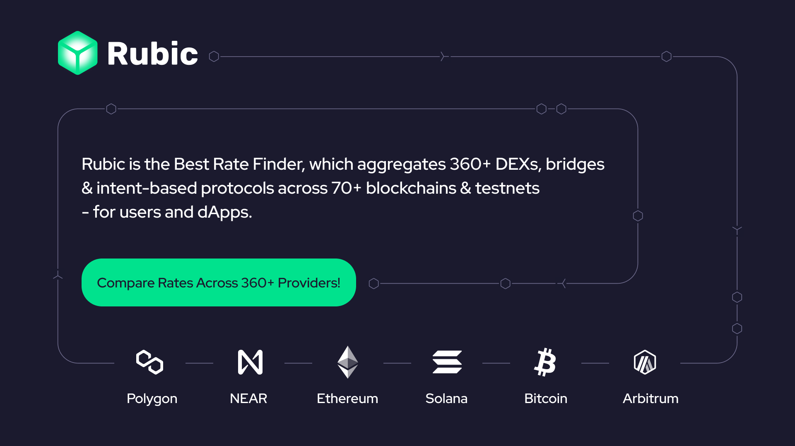

# Multichain DeFi platform
[Try our platform](https://app.rubic.exchange/)

[Read more about us](https://rubic.exchange/)

<!---->

## Rubic organizes defi services to enable a project to create, manage and trade tokens decentralized in ONE PLACE.
We already provide multichain services for creating and managing tokens (airdrop, crowdsale, pools) powered by MyWish.

Rubic's goal is to add multichain p2p trades to existing services and develop other products such as liquidity pools. And make it simple and user friendly.

[Read White Paper](https://rubic.exchange/pdf/white-paper.pdf)

[Read One Pager](https://rubic.exchange/pdf/one-pager.pdf)
